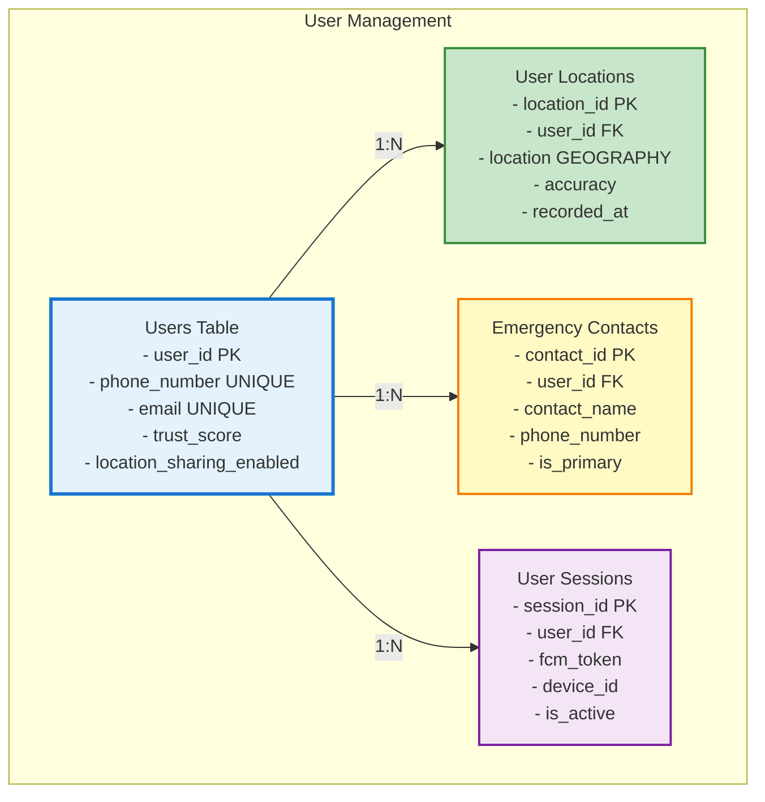
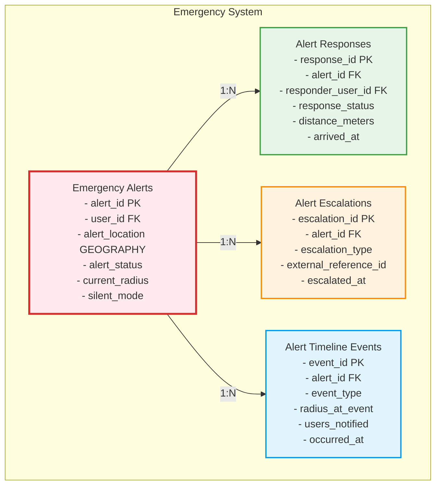
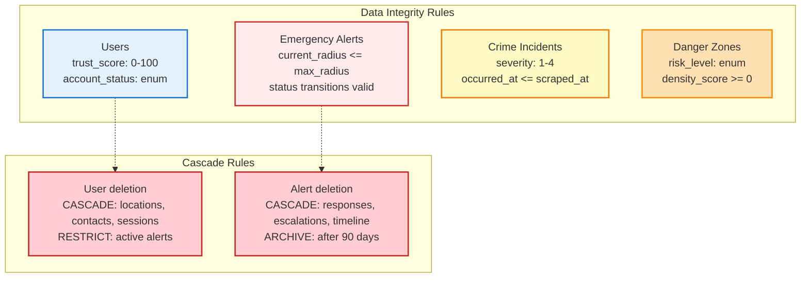

# SafeAround - Database Schema Diagram (ERD)
## Complete Entity Relationship Diagram with Visual Representations

## 1. COMPLETE ERD DIAGRAM (Mermaid Format)

## DETAILED TABLE STRUCTURES WITH RELATIONSHIPS
 Core User Management Tables

 Emergency Alert System Tables

