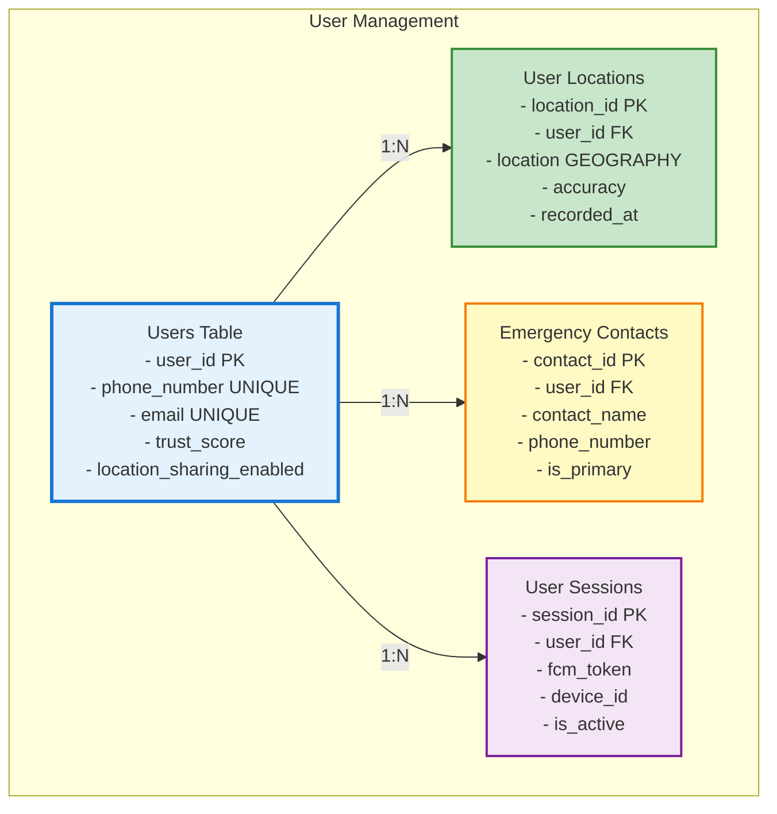
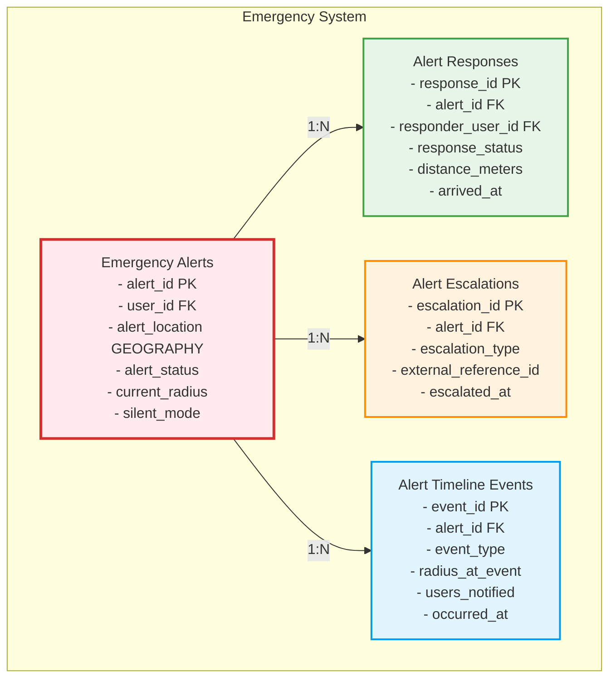
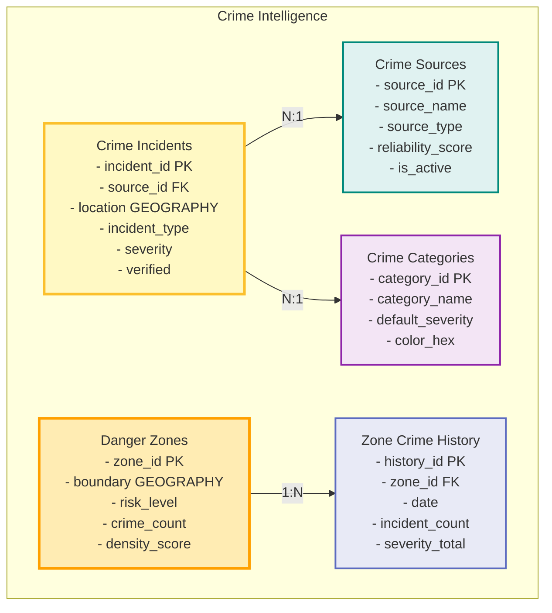
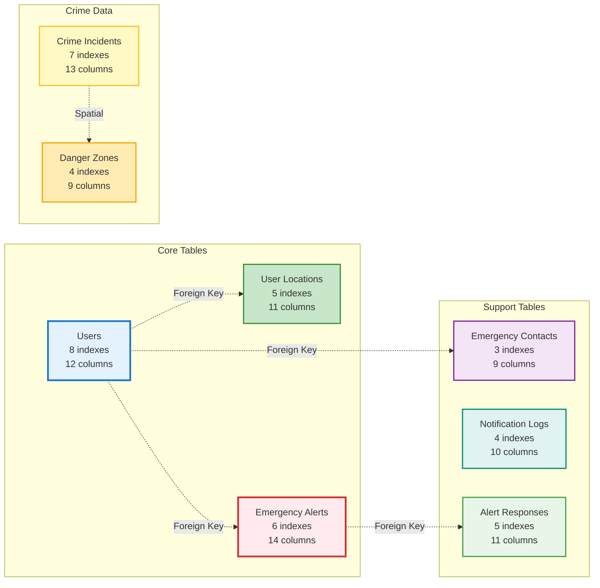
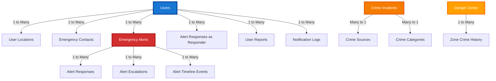
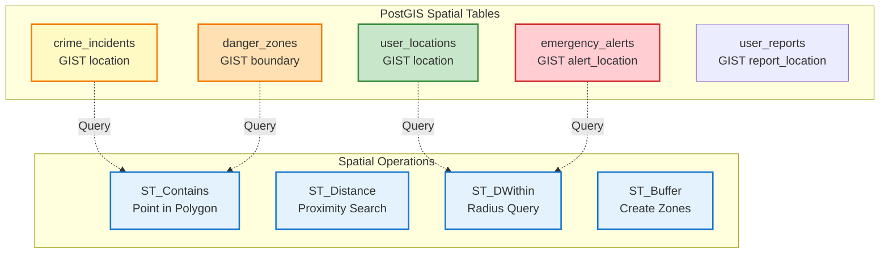
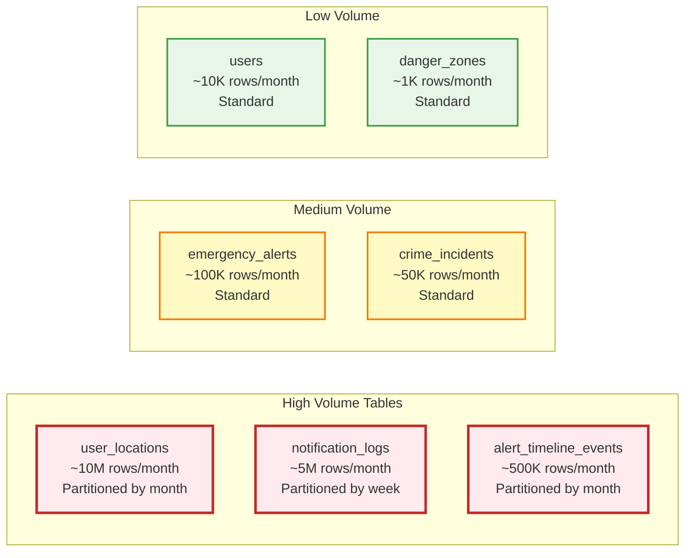
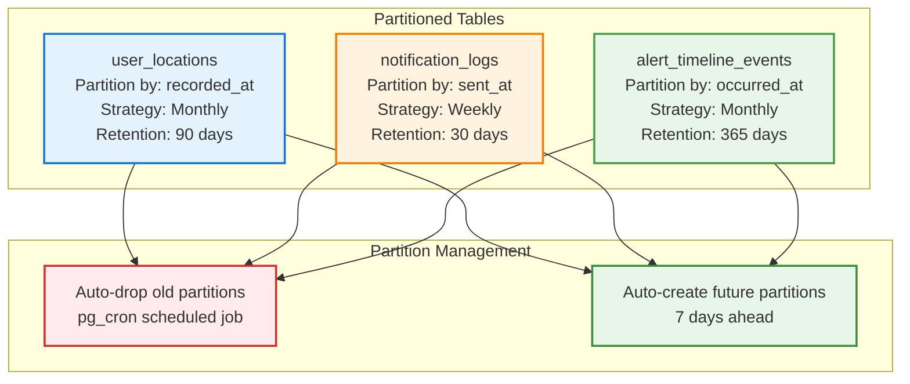
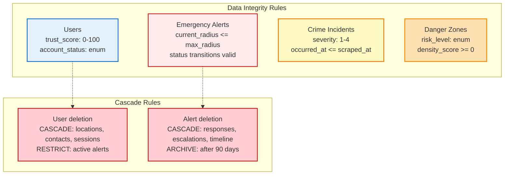

# SafeAround - Database Schema Diagram (ERD)
## Complete Entity Relationship Diagram with Visual Representations

## 1. COMPLETE ERD DIAGRAM (Mermaid Format)

```mermaid
erDiagram
    users ||--o{ user_locations : tracks
    users ||--o{ emergency_contacts : has
    users ||--o{ emergency_alerts : creates
    users ||--o{ alert_responses : responds
    users ||--o{ user_reports : submits
    users ||--o{ notification_logs : receives
    users ||--o{ user_sessions : has

    emergency_alerts ||--o{ alert_responses : receives
    emergency_alerts ||--o{ alert_escalations : escalates
    emergency_alerts ||--o{ alert_timeline_events : has
    
    crime_incidents }o--|| crime_sources : from
    crime_incidents }o--|| crime_categories : categorized
    
    danger_zones ||--o{ zone_crime_history : contains
    danger_zones }o--|| zone_risk_levels : has
    
    users {
        UUID user_id PK
        VARCHAR phone_number UK
        VARCHAR email UK
        VARCHAR full_name
        BOOLEAN location_sharing_enabled
        INTEGER alert_radius_preference
        BOOLEAN dnd_mode_enabled
        VARCHAR firebase_uid UK
        VARCHAR account_status
        INTEGER trust_score
        TIMESTAMPTZ created_at
        TIMESTAMPTZ last_active_at
        VARCHAR app_version
        VARCHAR device_platform
    }

    user_locations {
        BIGSERIAL location_id PK
        UUID user_id FK
        GEOGRAPHY location
        FLOAT accuracy
        FLOAT altitude
        FLOAT speed
        FLOAT heading
        VARCHAR battery_level
        VARCHAR network_type
        TIMESTAMPTZ recorded_at
        VARCHAR location_source
    }

    emergency_contacts {
        UUID contact_id PK
        UUID user_id FK
        VARCHAR contact_name
        VARCHAR phone_number
        VARCHAR relationship
        BOOLEAN is_primary
        BOOLEAN notify_on_alert
        INTEGER priority_order
        TIMESTAMPTZ created_at
    }

    emergency_alerts {
        UUID alert_id PK
        UUID user_id FK
        GEOGRAPHY alert_location
        VARCHAR alert_type
        VARCHAR alert_status
        INTEGER current_radius
        INTEGER max_radius_reached
        JSONB metadata
        VARCHAR audio_recording_url
        BOOLEAN silent_mode
        TIMESTAMPTZ created_at
        TIMESTAMPTZ resolved_at
        TIMESTAMPTZ cancelled_at
        VARCHAR cancellation_reason
    }

    alert_responses {
        UUID response_id PK
        UUID alert_id FK
        UUID responder_user_id FK
        VARCHAR response_status
        GEOGRAPHY responder_location
        INTEGER estimated_arrival_minutes
        FLOAT distance_meters
        TIMESTAMPTZ responded_at
        TIMESTAMPTZ arrived_at
        INTEGER response_rating
        TEXT response_feedback
    }

    alert_escalations {
        UUID escalation_id PK
        UUID alert_id FK
        VARCHAR escalation_type
        VARCHAR escalation_status
        JSONB escalation_payload
        VARCHAR external_reference_id
        TIMESTAMPTZ escalated_at
        TIMESTAMPTZ acknowledged_at
    }

    alert_timeline_events {
        UUID event_id PK
        UUID alert_id FK
        VARCHAR event_type
        INTEGER radius_at_event
        INTEGER users_notified
        INTEGER responders_count
        JSONB event_data
        TIMESTAMPTZ occurred_at
    }

    crime_incidents {
        UUID incident_id PK
        UUID source_id FK
        UUID category_id FK
        GEOGRAPHY location
        VARCHAR incident_type
        INTEGER severity
        TEXT description
        VARCHAR address
        JSONB metadata
        BOOLEAN verified
        TIMESTAMPTZ occurred_at
        TIMESTAMPTZ reported_at
        TIMESTAMPTZ scraped_at
    }

    crime_sources {
        UUID source_id PK
        VARCHAR source_name
        VARCHAR source_type
        VARCHAR api_endpoint
        JSONB auth_config
        INTEGER reliability_score
        BOOLEAN is_active
        TIMESTAMPTZ last_successful_fetch
    }

    crime_categories {
        UUID category_id PK
        VARCHAR category_name
        VARCHAR category_code
        INTEGER default_severity
        VARCHAR icon_name
        VARCHAR color_hex
    }

    danger_zones {
        UUID zone_id PK
        GEOGRAPHY boundary
        VARCHAR risk_level
        INTEGER crime_count
        FLOAT density_score
        INTEGER severity_sum
        JSONB statistics
        TIMESTAMPTZ calculated_at
        TIMESTAMPTZ valid_until
    }

    zone_risk_levels {
        VARCHAR risk_level PK
        INTEGER min_score
        INTEGER max_score
        VARCHAR color_hex
        VARCHAR display_label
    }

    zone_crime_history {
        UUID history_id PK
        UUID zone_id FK
        DATE date
        INTEGER incident_count
        INTEGER severity_total
        JSONB crime_type_breakdown
    }

    user_reports {
        UUID report_id PK
        UUID user_id FK
        GEOGRAPHY report_location
        VARCHAR report_type
        TEXT description
        VARCHAR media_url
        VARCHAR status
        INTEGER upvote_count
        INTEGER downvote_count
        BOOLEAN verified
        TIMESTAMPTZ reported_at
        TIMESTAMPTZ verified_at
    }

    notification_logs {
        UUID notification_id PK
        UUID user_id FK
        VARCHAR notification_type
        VARCHAR delivery_channel
        JSONB payload
        VARCHAR status
        VARCHAR device_token
        TIMESTAMPTZ sent_at
        TIMESTAMPTZ delivered_at
        TIMESTAMPTZ read_at
    }

    user_sessions {
        UUID session_id PK
        UUID user_id FK
        VARCHAR device_id
        VARCHAR fcm_token
        VARCHAR apns_token
        JSONB device_info
        BOOLEAN is_active
        TIMESTAMPTZ created_at
        TIMESTAMPTZ expires_at
        TIMESTAMPTZ last_seen_at
    }
```


## DETAILED TABLE STRUCTURES WITH RELATIONSHIPS
 Core User Management Tables


 Emergency Alert System Tables


Crime Data & Heatmap Tables


## 3. DATABASE SCHEMA OVERVIEW WITH STATISTICS


## 4. KEY RELATIONSHIPS & CARDINALITY

## 5. SPATIAL INDEXES & GEOSPATIAL TABLES


## 6. TABLE SIZES & GROWTH ESTIMATES

# 7. INDEXING STRATEGY
## Primary Indexes (BTREE)
users:
  - PRIMARY KEY (user_id)
  - UNIQUE INDEX (phone_number)
  - UNIQUE INDEX (email)
  - INDEX (account_status) WHERE status = 'active'
  - INDEX (last_active_at) WHERE last_active > NOW() - 7 days

emergency_alerts:
  - PRIMARY KEY (alert_id)
  - INDEX (user_id, created_at DESC)
  - INDEX (alert_status, created_at DESC)
  - INDEX (created_at) WHERE alert_status IN ('active', 'responding')

crime_incidents:
  - PRIMARY KEY (incident_id)
  - INDEX (occurred_at DESC)
  - INDEX (incident_type, severity)
  - INDEX (verified) WHERE verified = true

## Spatial Indexes (GIST)
user_locations:
  - GIST INDEX (location)
  - Supports: ST_DWithin, ST_Distance queries

emergency_alerts:
  - GIST INDEX (alert_location)
  - Supports: Radius expansion queries

crime_incidents:
  - GIST INDEX (location)
  - Supports: Heatmap aggregation

danger_zones:
  - GIST INDEX (boundary)
  - Supports: ST_Contains queries
Composite Indexes

## alert_responses:
  - INDEX (alert_id, response_status, responded_at)
  - INDEX (responder_user_id, responded_at DESC)

notification_logs:
  - INDEX (user_id, sent_at DESC)
  - INDEX (notification_type, status, sent_at)

## 8. TABLE PARTITIONING STRATEGY


## 9. MATERIALIZED VIEWS FOR PERFORMANCE
```sql
-- Danger Zones Materialized View
CREATE MATERIALIZED VIEW mv_danger_zones AS
SELECT
    ST_SnapToGrid(location::geometry, 0.01) as grid_cell,
    COUNT(*) as incident_count,
    SUM(severity) as severity_total,
    AVG(severity) as avg_severity,
    MAX(occurred_at) as last_incident
FROM crime_incidents
WHERE occurred_at > NOW() - INTERVAL '30 days'
GROUP BY grid_cell;

CREATE INDEX ON mv_danger_zones USING GIST(grid_cell);
REFRESH MATERIALIZED VIEW CONCURRENTLY mv_danger_zones;

-- User Activity Summary
CREATE MATERIALIZED VIEW mv_user_activity AS
SELECT
    user_id,
    COUNT(DISTINCT DATE(recorded_at)) as active_days,
    MAX(recorded_at) as last_location_update,
    COUNT(*) as total_locations
FROM user_locations
WHERE recorded_at > NOW() - INTERVAL '30 days'
GROUP BY user_id;

CREATE INDEX ON mv_user_activity(user_id);
REFRESH MATERIALIZED VIEW CONCURRENTLY mv_user_activity;
```
## 10. DATABASE CONSTRAINTS & BUSINESS RULES

## 11. COMPLETE TABLE SUMMARY

| Table Name | Primary Key | Foreign Keys | Spatial | Partitioned | Indexes |
|------------|-------------|--------------|---------|-------------|---------|
| users | user_id | - | No | No | 8 |
| user_locations | location_id | user_id | Yes (GEOGRAPHY) | Yes (monthly) | 5 |
| emergency_contacts | contact_id | user_id | No | No | 3 |
| emergency_alerts | alert_id | user_id | Yes (GEOGRAPHY) | No | 6 |
| alert_responses | response_id | alert_id, responder_user_id | Yes (GEOGRAPHY) | No | 5 |
| alert_escalations | escalation_id | alert_id | No | No | 3 |
| alert_timeline_events | event_id | alert_id | No | Yes (monthly) | 4 |
| crime_incidents | incident_id | source_id, category_id | Yes (GEOGRAPHY) | No | 7 |
| crime_sources | source_id | - | No | No | 2 |
| crime_categories | category_id | - | No | No | 2 |
| danger_zones | zone_id | - | Yes (GEOGRAPHY) | No | 4 |
| zone_crime_history | history_id | zone_id | No | No | 3 |
| user_reports | report_id | user_id | Yes (GEOGRAPHY) | No | 4 |
| notification_logs | notification_id | user_id | No | Yes (weekly) | 4 |
| user_sessions | session_id | user_id | No | No | 3 |

**Total Tables:** 15  
**Total Indexes:** 67 (including 5 spatial GIST indexes)  
**Partitioned Tables:** 3  
**Tables with Spatial Data:** 6  

---

## 12. QUERY PERFORMANCE OPTIMIZATION

### Most Frequent Queries:
```sql
-- 1. Find nearby users (Geofencing)
SELECT user_id, ST_Distance(location, $1) as distance
FROM user_locations
WHERE ST_DWithin(location, $1, $2)
AND recorded_at > NOW() - INTERVAL '5 minutes'
ORDER BY distance
LIMIT 50;

-- 2. Get danger zone for location
SELECT zone_id, risk_level, crime_count
FROM danger_zones
WHERE ST_Contains(boundary, $1)
LIMIT 1;

-- 3. Active alerts in area
SELECT alert_id, user_id, alert_status, current_radius
FROM emergency_alerts
WHERE alert_status IN ('active', 'responding')
AND ST_DWithin(alert_location, $1, $2)
ORDER BY created_at DESC;
```