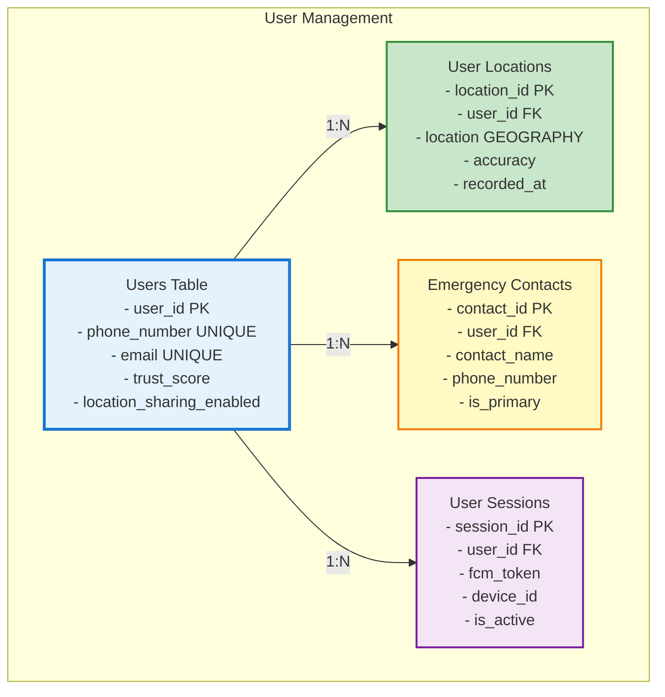
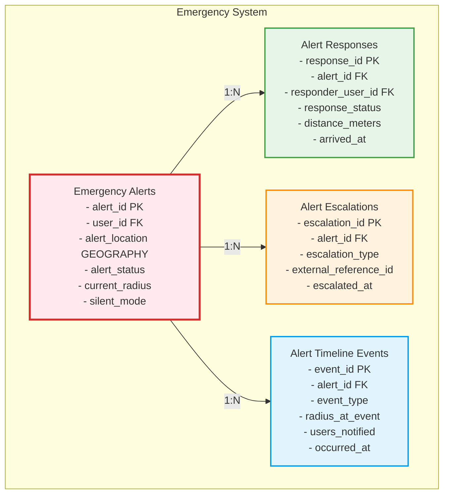
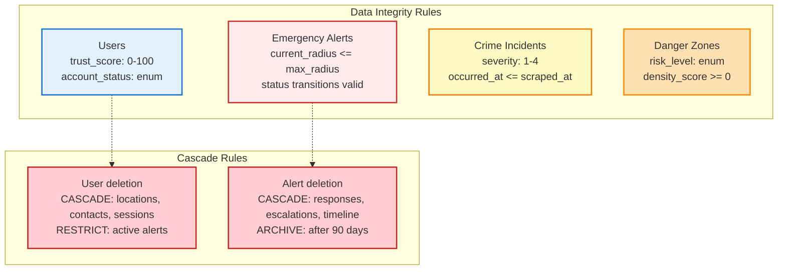

# DETAILED TABLE STRUCTURES WITH RELATIONSHIPS
## Core User Management Tables

```mermaid
graph TB
    subgraph User Management
        Users[Users Table<br/>- user_id PK<br/>- phone_number UNIQUE<br/>- email UNIQUE<br/>- trust_score<br/>- location_sharing_enabled]
        
        UserLocations[User Locations<br/>- location_id PK<br/>- user_id FK<br/>- location GEOGRAPHY<br/>- accuracy<br/>- recorded_at]
        
        EmergencyContacts[Emergency Contacts<br/>- contact_id PK<br/>- user_id FK<br/>- contact_name<br/>- phone_number<br/>- is_primary]
        
        Sessions[User Sessions<br/>- session_id PK<br/>- user_id FK<br/>- fcm_token<br/>- device_id<br/>- is_active]
    end
    
    Users -->|1:N| UserLocations
    Users -->|1:N| EmergencyContacts
    Users -->|1:N| Sessions
    
    style Users fill:#E3F2FD,stroke:#1976D2,stroke-width:3px
    style UserLocations fill:#C8E6C9,stroke:#388E3C,stroke-width:2px
    style EmergencyContacts fill:#FFF9C4,stroke:#F57C00,stroke-width:2px
    style Sessions fill:#F3E5F5,stroke:#7B1FA2,stroke-width:2px
```

## Emergency Alert System Tables

```mermaid
graph TB
    subgraph Emergency System
        Alerts[Emergency Alerts<br/>- alert_id PK<br/>- user_id FK<br/>- alert_location GEOGRAPHY<br/>- alert_status<br/>- current_radius<br/>- silent_mode]
        
        Responses[Alert Responses<br/>- response_id PK<br/>- alert_id FK<br/>- responder_user_id FK<br/>- response_status<br/>- distance_meters<br/>- arrived_at]
        
        Escalations[Alert Escalations<br/>- escalation_id PK<br/>- alert_id FK<br/>- escalation_type<br/>- external_reference_id<br/>- escalated_at]
        
        Timeline[Alert Timeline Events<br/>- event_id PK<br/>- alert_id FK<br/>- event_type<br/>- radius_at_event<br/>- users_notified<br/>- occurred_at]
    end
    
    Alerts -->|1:N| Responses
    Alerts -->|1:N| Escalations
    Alerts -->|1:N| Timeline
    
    style Alerts fill:#FFEBEE,stroke:#D32F2F,stroke-width:3px
    style Responses fill:#E8F5E9,stroke:#43A047,stroke-width:2px
    style Escalations fill:#FFF3E0,stroke:#FB8C00,stroke-width:2px
    style Timeline fill:#E1F5FE,stroke:#039BE5,stroke-width:2px
```

```mermaid
graph TB
    subgraph Data Integrity Rules
        C1[Users<br/>trust_score: 0-100<br/>account_status: enum]
        C2[Emergency Alerts<br/>current_radius <= max_radius<br/>status transitions valid]
        C3[Crime Incidents<br/>severity: 1-4<br/>occurred_at <= scraped_at]
        C4[Danger Zones<br/>risk_level: enum<br/>density_score >= 0]
    end
    
    subgraph Cascade Rules
        D1[User deletion<br/>CASCADE: locations, contacts, sessions<br/>RESTRICT: active alerts]
        D2[Alert deletion<br/>CASCADE: responses, escalations, timeline<br/>ARCHIVE: after 90 days]
    end
    
    C1 -.-> D1
    C2 -.-> D2
    
    style C1 fill:#E3F2FD,stroke:#1976D2,stroke-width:2px
    style C2 fill:#FFEBEE,stroke:#D32F2F,stroke-width:2px
    style C3 fill:#FFF9C4,stroke:#F57C00,stroke-width:2px
    style C4 fill:#FFE0B2,stroke:#FB8C00,stroke-width:2px
    style D1 fill:#FFCDD2,stroke:#C62828,stroke-width:2px
    style D2 fill:#FFCDD2,stroke:#C62828,stroke-width:2px
```

